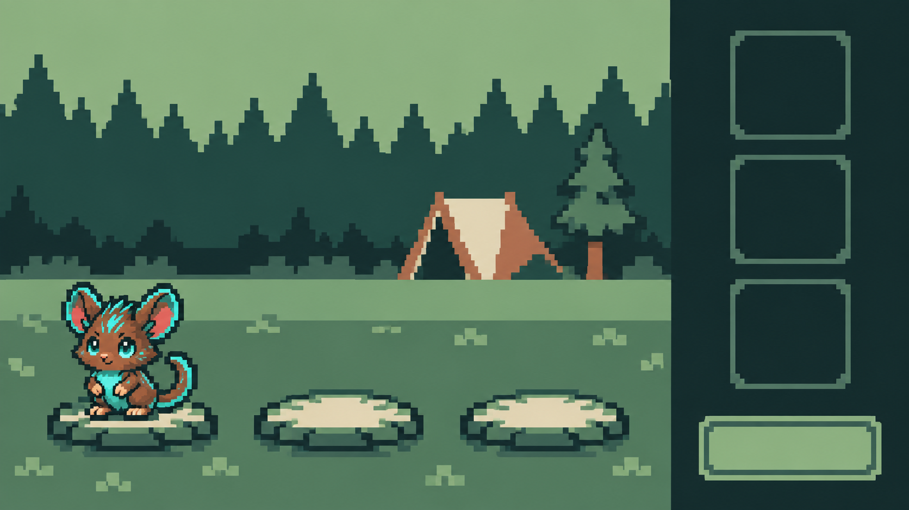
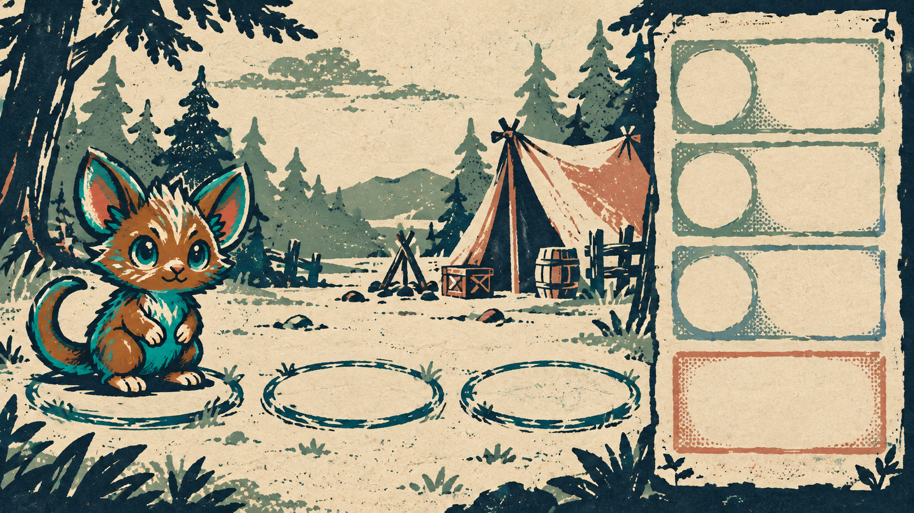
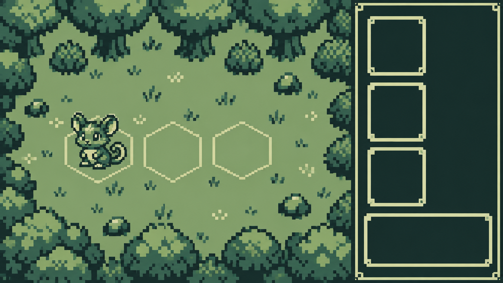

# 驯牌远征：降低“AI 风”的三条美术方向

三张图使用同一比较题目：迅迅、林间布阵、三个站位与右侧候选栏。它们是视觉方向稿，刻意不包含文字或真实数值，不能直接作为游戏背景替换。生物身份只参考现有迅迅，布局只作为比较用例。

## 当前素材的问题

现有背景、石框、生物立绘各自精细，却缺少统一的像素尺度：小石缝、苔藓、萤光、远景灯点和轮廓高光同时存在。明暗对比多落在装饰而非站位、单位和按钮上，素材缩到实际 UI 尺寸后容易显得糊与吵。改版重点应是建立资产规格，而不是继续叠加“更漂亮”的细节。

## 方向 1：克制的 16-bit 像素

- 延续目前夜色森林与迅迅形象，迁移成本最低。环境使用重复地块、成簇阴影；站位与单位比背景亮一档。
- 生产规格建议：统一 4 px 主网格、角色以 64×64 或 96×96 原生像素绘制、单场景不超过 24 色；同类物体共用边线厚度和阴影级数。
- 风险：方向稿的平涂区域仍有生成图的微弱平滑过渡，正式制作时须在原生像素网格上人工重绘。`01-restrained-pixel.png` 是保留较多旧营地细节的早期探索稿，可直接对比为何需要删减。

## 方向 2：林野版画图鉴

- 将世界设定表达为驯兽师随身图鉴：画面由纸、套色油墨和刻刀边缘组成，生物像印在纸上的收藏条目。与常见霓虹奇幻像素明显区分。
- 生产规格建议：深墨、鼠尾草、纸白、锈红、深青五色；背景只在边缘保留纸纹；生物用大块色与清晰轮廓，UI 以图鉴页签、印章和留白组织。
- 风险：这是跨媒介重设计，现有像素生物和底座不能混用；纸纹若进入文字区会损害可读性。制作量最大，但辨识度也最高。

## 方向 3：四阶色掌机远征

- 把限制本身变成识别点：四种色阶、硬边方块、重复地块、极简生物动作。图像不靠光效，站位、路径和状态更容易成为主角。
- 生产规格建议：全局仅四个屏幕色，原生 160×144 或其整数倍的像素网格；角色保持 24–32 px 高、1 px 外轮廓；所有缩放只用 nearest-neighbor。
- 风险：样图采用俯视构图，与当前六位布阵的侧视呈现不一致。若选择此方向，应先决定是只借用配色与资产约束，还是连战斗视角一起重做。四阶色也不适合靠颜色单独区分所有状态。

## 建议

优先选方向 3 的**制作纪律**，但保留当前侧视战斗布局，并将可用颜色放宽到 6–8 色。这样能保留用户熟悉的像素路线，又能最快摆脱随机细节与泛光带来的“AI 风”。若希望游戏整体形成更强的独立品牌，再选方向 2；方向 1 适合作为低风险过渡。

选定方向后，先做一套最小纵切片：迅迅一只、森林普通战背景一张、战斗底座、四个节点图标、一个通用弹窗。以 1280×860 和 960×640 的实际界面尺寸检查轮廓、文字对比与色彩语义，通过后再批量重绘其他素材。不要先重画全部生物。

## 样图来源与限制

三张选定样图均使用内置 imagegen，以现有 `public/battle-momo.png` 作为迅迅身份参考；第一张的早期探索稿还参考了 `public/formation-camp.png` 的营地布局。提示词分别约束为：①严格像素网格、有限色与成簇阴影的 16-bit 布阵；②五色套印、版画刻线与纸本图鉴；③四阶色掌机、重复地块与极简 UI。均要求无文字、无数值、无渐变与无水印。生成图只用于选择方向；正式素材需人工统一轮廓、色板、网格和可复用地块。
